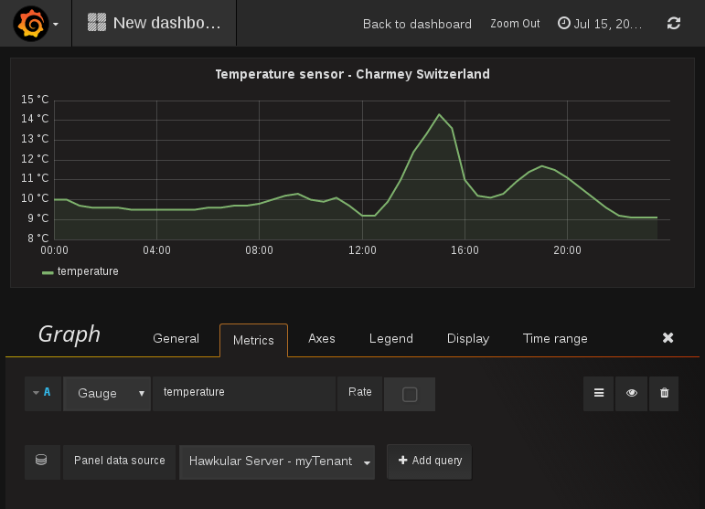

= Hawkular Services Getting Started Guide
Thomas Heute
2016-07-15
:description: Getting started with Hawkular
:jbake-type: page
:jbake-status: published
:icons: font
:toc: macro
:toc-title:

toc::[]

== Install Hawkular

Please refer to the link:../installation-guide/[installation guide] to install Hawkular Server

== Step 1: Add metrics
In this quickstart guide, we'll start by injecting metrics in the server. For this part we don't need additional metadata nor tags on our metrics,
we really want to start as quickly as possible, advanced features will be explained in other documents.

Let's say we want to insert Weather temperature from a sensor so that we can keep an history and then visualize or alert on those values.

NOTE: Hawkular Services provides different libraries for different languages, but here we will just use the REST API with CURL.

Copy the following content in a file named `request.json`, it contains weather data collected every 30 min for the whole day of July 15th 2016.

.request.json
----
include::includes/request.json[]
----

To insert metrics, we just need a running Hawkular Server and make sure we created a user according to the instructions. You can replace the values of the `Hawkular-Tenant` and `temperature` in the URL
with the values of your choice, in this simple scenario, we don't need to make additional calls to create those.

----
curl -u myUsername:myPassword -X POST http://localhost:8080/hawkular/metrics/gauges/temperature/raw -d @request.json -H "Content-Type: application/json" -H "Hawkular-Tenant: myTenant"
----

Now your data is stored in Hawkular Server, in it's distributed Cassandra server. It's ready to be used !

== Step 2: Read the metrics
=== With Grafana
At the end of Step 1, you need to trust Hawkular that the data was indeed stored.
The most elegant way to see the data is by link:/hawkular-clients/grafana/[setting up Grafana and its Hawkular plugin] to actually build a dashboard and look at the `temperature` metric over that day (July 15th 2016) for `myTenant`.
Here would be the result:

[[img-main]]
.Visualization of the metrics in Grafana
ifndef::env-github[]
image::/img/hawkular-services/docs/quickstart-guide/grafana.png[Grafana]
endif::[]
ifdef::env-github[]

endif::[]

=== With the REST API

The metrics API provides ways to retrieve raw or downsnampled values, here is a command to get back the raw value as we inserted earlier, for a part of the day.
The URL is the same, the command is a GET instead of a POST and we added extra parameters to define from when to when we want the values,
and that we want the data ordered by time.

.Curl command
----
curl -u myUsername:myPassword \
  -X GET "http://localhost:8080/hawkular/metrics/gauges/temperature/raw?start=1468578600000&end=1468594800001&order=ASC" \
  -H "Content-Type: application/json" -H "Hawkular-Tenant: myTenant"
----

This would be the result of that command:

.Command result
----
[
  {
    "timestamp": 1468578600000,
    "value": 9.2
  },
  {
    "timestamp": 1468580400000,
    "value": 9.9
  },
  {
    "timestamp": 1468582200000,
    "value": 11
  },
  {
    "timestamp": 1468584000000,
    "value": 12.4
  },
  {
    "timestamp": 1468585800000,
    "value": 13.3
  },
  {
    "timestamp": 1468587600000,
    "value": 14.3
  },
  {
    "timestamp": 1468589400000,
    "value": 13.6
  },
  {
    "timestamp": 1468591200000,
    "value": 11
  },
  {
    "timestamp": 1468593000000,
    "value": 10.2
  },
  {
    "timestamp": 1468594800000,
    "value": 10.1
  }
]
----

It is likely that the data will need to be downsampled, if there are too many data points in a short period of time. For instance to display two years of weather
in a graph, the precision every 30min is likely too much. The timeseries database allow to get "buckets" of data, which could be determined by the number of
datapoints (size of the bucket) or the duration of a bucket. In this example, let's say we want to know the minimum, maximum and average values for buckets that
would last 2 hours. Since we have 24h of data, we should end up with 12 buckets of 4 data points (since we have 4 data points in 2h).

.Percentiles
NOTE: It is also possible to add percentiles values to the results, see the link:/hawkular-metrics/docs/user-guide/#_downsampling[Metrics User Guide].

.Curl command
----
curl -u myUsername:myPassword -X GET "http://localhost:8080/hawkular/metrics/gauges/temperature/stats?bucketDuration=2h&start=1468533600000&end=1468618200001" -H "Content-Type: application/json" -H "Hawkular-Tenant: myTenant"
----

.Command result
----
[
  {
    "start": 1468533600000,
    "end": 1468540800000,
    "min": 9.6,
    "avg": 9.825,
    "median": 9.7,
    "max": 10,
    "sum": 39.3,
    "samples": 4,
    "empty": false
  },
  {
    "start": 1468540800000,
    "end": 1468548000000,
    "min": 9.5,
    "avg": 9.55,
    "median": 9.5,
    "max": 9.6,
    "sum": 38.2,
    "samples": 4,
    "empty": false
  },
  {
    "start": 1468548000000,
    "end": 1468555200000,
    "min": 9.5,
    "avg": 9.5,
    "median": 9.5,
    "max": 9.5,
    "sum": 38,
    "samples": 4,
    "empty": false
  },
  {
    "start": 1468555200000,
    "end": 1468562400000,
    "min": 9.6,
    "avg": 9.649999999999999,
    "median": 9.6,
    "max": 9.7,
    "sum": 38.6,
    "samples": 4,
    "empty": false
  },
  {
    "start": 1468562400000,
    "end": 1468569600000,
    "min": 9.8,
    "avg": 10.075,
    "median": 10,
    "max": 10.3,
    "sum": 40.3,
    "samples": 4,
    "empty": false
  },
  {
    "start": 1468569600000,
    "end": 1468576800000,
    "min": 9.7,
    "avg": 9.924999999999999,
    "median": 9.9,
    "max": 10.1,
    "sum": 39.699999999999996,
    "samples": 4,
    "empty": false
  },
  {
    "start": 1468576800000,
    "end": 1468584000000,
    "min": 9.2,
    "avg": 9.825,
    "median": 9.2,
    "max": 11,
    "sum": 39.3,
    "samples": 4,
    "empty": false
  },
  {
    "start": 1468584000000,
    "end": 1468591200000,
    "min": 12.4,
    "avg": 13.399999999999999,
    "median": 13.3,
    "max": 14.3,
    "sum": 53.6,
    "samples": 4,
    "empty": false
  },
  {
    "start": 1468591200000,
    "end": 1468598400000,
    "min": 10.1,
    "avg": 10.399999999999999,
    "median": 10.2,
    "max": 11,
    "sum": 41.599999999999994,
    "samples": 4,
    "empty": false
  },
  {
    "start": 1468598400000,
    "end": 1468605600000,
    "min": 10.9,
    "avg": 11.375,
    "median": 11.4,
    "max": 11.7,
    "sum": 45.5,
    "samples": 4,
    "empty": false
  },
  {
    "start": 1468605600000,
    "end": 1468612800000,
    "min": 9.6,
    "avg": 10.35,
    "median": 10.1,
    "max": 11.1,
    "sum": 41.4,
    "samples": 4,
    "empty": false
  },
  {
    "start": 1468612800000,
    "end": 1468620000000,
    "min": 9.1,
    "avg": 9.125,
    "median": 9.1,
    "max": 9.2,
    "sum": 36.5,
    "samples": 4,
    "empty": false
  }
]
----

.Learn more
NOTE: We only scratched the surface of what we can do when storing and retrieving metrics, in the link:/hawkular-metrics/docs/user-guide/#_downsampling[Metrics User Guide]
you will see how to tag metrics, aggregate values from various metrics and other advanced features.
